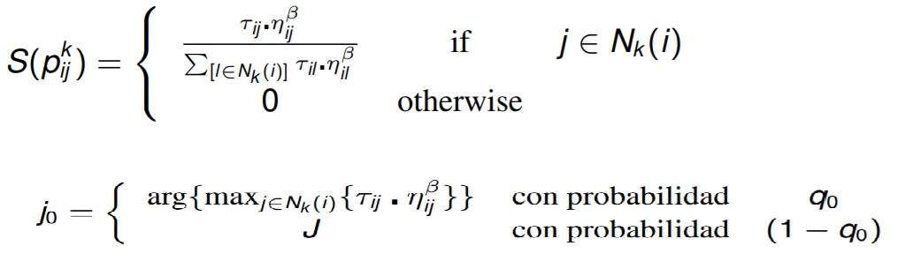

## Una Solución Al Problema del Vendedor Viajero (TSP) con Algoritmo de Colonia de Hormigas (ACO)

### Acerca de este Algoritmo

Esta es una implementación en Python de la solución al problema del vendedor viajero por medio de colonia de hormigas. Encuentra Rutas con una desviación promedio del óptimo (7542) de aprox.  700 unidades por sobre dicho valor.

### Parametros    

1. __Name File__ : Este parametro debe ser una secuencia de caracteres alfanuméricos que se utiliza para obtener la ruta del archivo del cual se extraeran las coordenadas para obtener una ruta óptima.
2. __Evaporation Rate__ : Es un número flotante mayor a cero y menor o igual que 1 que indica el peso de la pheromona en el algoritmo o la tasa en que la feromona dejada por la hormiga se irá intensificando o evaporando, según sea el caso.
3. __Number Iterations__: Es un número entero positivo mayor a 0 que nos dice la cantidad de veces que planeamos iterar como máximo para encontrar una solución.
4. __Number Ants__: Es un número entero positivo mayor a 0 que indica la cantidad de hormigas que deberán encontrar una ruta entre las ciudades minimizando el costo de esta. IMPORTANTE: debido a operaciones dentro del algoritmo. La cantidad de hormigas debe ser siempre igual a la cantidad de ciudades que se debe visitar. Lo lamento.
5. __Heuristic Coefficient__: Es un número flotante entre 0 y 5 que indica el peso o la incidencia de la heurística sobre el algoritmo al momento de encontrar una ruta óptima.
6. __q0__: Es un número flotante entre 0 y 1 que indica la probabilidad de que se escoga el metodo de la ecuación 1  o método de la ecuación 2.

    

    

### Instrucciones para correr el programa en una terminal linux

~~~
$ git clone https://github.com/IsaacOrmeno/AMIN-T2.git 
~~~

~~~
$ cd AMIN-T1 
~~~
~~~
 $ python3.6 AlgoritmoGenetico_NQueens.py "name_file" "evaporation_rate" "number_iterations" "number_ants" "heuristic_coefficient" "q0" 
~~~
